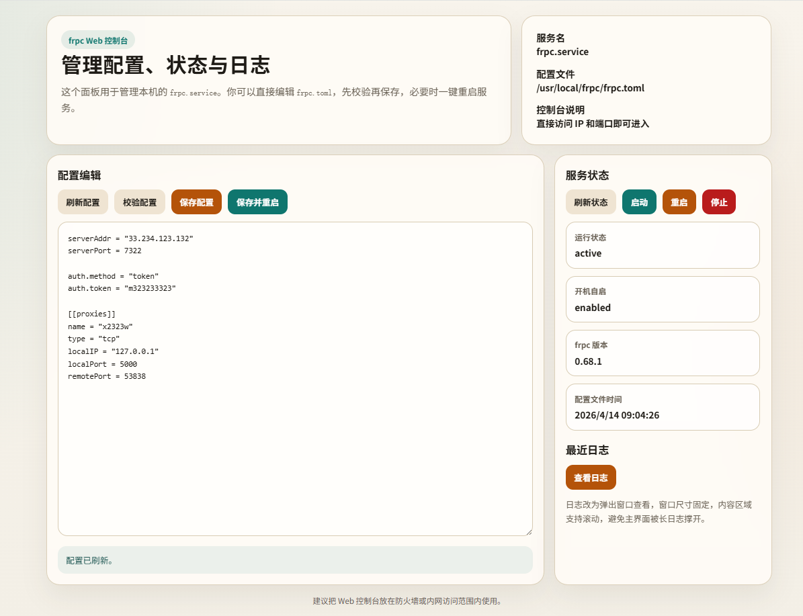

# 🚀 frp 一键安装脚本

一个适用于 `Debian 12` 的 `frp` 安装脚本，支持交互式安装 `frps` 服务端、`frpc` 客户端、更新、卸载，以及客户端 Web 控制台。

## 🖼️ 界面预览



## ✨ 功能特性

- 📦 自动安装 `frp` 最新版本
- 🌐 支持 GitHub 加速下载
- 🖥️ 支持安装 `frps` 服务端
- 🔌 支持安装 `frpc` 客户端
- 🔄 支持更新 `frps` / `frpc`
- 🗑️ 支持卸载 `frps` / `frpc`
- ⚙️ 自动生成 `systemd` 服务
- 📂 自动写入配置文件到指定目录
- 🧭 提供 `frpc Web 控制台`
- 📋 支持查看当前安装状态

## 📁 安装路径

- `frps` 安装目录：`/usr/local/frps`
- `frpc` 安装目录：`/usr/local/frpc`
- `frpc Web 控制台` 目录：`/usr/local/frpc/web`

## 🧰 依赖环境

- `Debian 12`
- `systemd`
- `root` 权限

脚本会自动安装这些依赖：

- `curl`
- `jq`
- `tar`
- `python3`

## 🚀 使用方法

先给脚本执行权限：

```bash
chmod +x install_frp.sh
```

运行脚本：

```bash
./install_frp.sh
```

## 📜 菜单说明

运行后会出现以下菜单：

```text
1) 安装 frps 服务端
2) 安装 frpc 客户端
3) 更新 frps 服务端
4) 更新 frpc 客户端
5) 卸载 frps 服务端
6) 卸载 frpc 客户端
7) 查看当前安装状态
```

## 🖥️ frpc Web 控制台

安装 `frpc` 时，脚本会询问是否部署 `frpc Web 控制台`。

控制台特性：

- 📝 在线编辑 `frpc.toml`
- ✅ 在线校验配置
- 🔄 一键重启 `frpc`
- 📊 查看运行状态
- 📚 查看日志弹窗
- 🌍 直接访问 `IP:端口` 即可进入，无需登录

默认会让你输入：

- 监听地址，默认 `0.0.0.0`
- 监听端口，默认 `7410`

## ⚙️ systemd 服务

脚本会自动创建这些服务：

- `frps.service`
- `frpc.service`
- `frpc-web.service`

常用命令：

```bash
systemctl status frps
systemctl status frpc
systemctl status frpc-web
```

```bash
systemctl restart frps
systemctl restart frpc
systemctl restart frpc-web
```

## 📂 配置文件位置

- `frps` 配置：`/usr/local/frps/frps.toml`
- `frpc` 配置：`/usr/local/frpc/frpc.toml`
- Web 控制台配置：`/usr/local/frpc/web/panel.json`

## 🔄 更新说明

如果你修改了脚本里的 Web 控制台页面或逻辑，想让机器上的现有控制台同步更新，可以执行：

```bash
./install_frp.sh
```

然后选择：

```text
4) 更新 frpc 客户端
```

这样会：

- 更新 `frpc` 二进制
- 保留原有 `frpc.toml`
- 刷新 Web 控制台文件
- 重启 `frpc.service`
- 重启 `frpc-web.service`

## ⚠️ 注意事项

- 🔐 `frps` 建议使用复杂 `token`
- 🌍 `frpc Web 控制台` 如果对公网开放，请自行配合防火墙使用
- 🧯 卸载操作会删除安装目录和对应服务文件
- 💾 覆盖配置前，脚本会自动备份旧文件

## 🙌 适用场景

- 想快速搭建 `frps` 服务端
- 想快速部署 `frpc` 客户端
- 不想手动写 `systemd`
- 想要一个简单直观的 `frpc` Web 管理界面

## 📌 说明

本项目是一个偏实用型脚本，目标就是：

> 少折腾，能安装，能更新，能卸载，能管理。 😄
